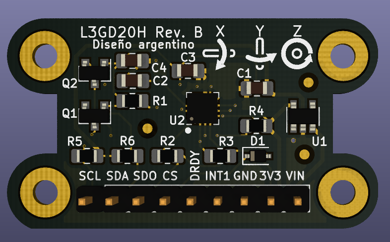
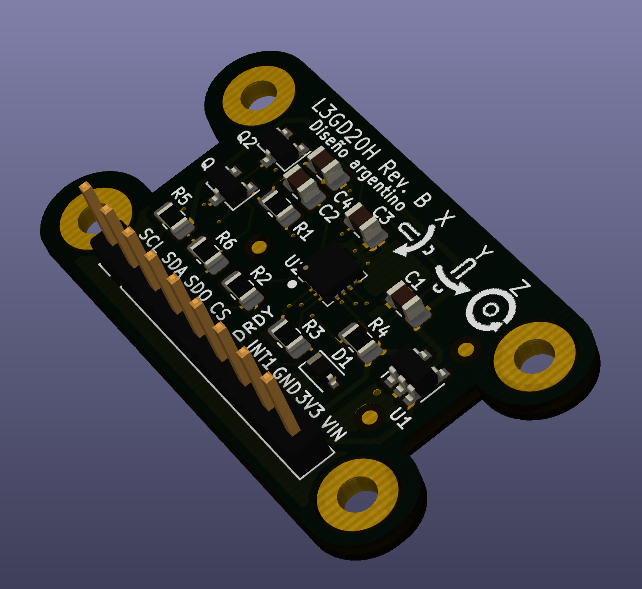

## Trabajo práctico final de la asignatura DCI ##
Este repositorio contiene el trabajo práctico final para la asignatura de Diseño de Circuitos Impresos de la carrera de posgrado de FIUBA.

* **Autor:** Gustavo Zocco
* **Revisor:** Agustín Curcio Berardi
* **Docente:** Diego Brengui
* **Título corto del trabajo:** Réplica Giroscopio L3GD20H.
* **Descripción:**  Réplica del módulo giroscopio de 3 ejes con el CI L3GD20H.

     
    <b>Figura 1</b>. Vista de frente de la placa adaptada. 

     
    <b>Figura 2</b>. Vista en perspectiva 3d de la placa adaptada. 

## Adaptaciones realizadas al replicar la placa ##

En este trabajo se realizaron adaptaciones sobre la placa propuesta a los efectos de satisfacer los requerimientos establecidos, como se detalla a cantinuación:

- Se agregó un tercer fiducial.
- Se agregaron las referencias a los componentes que no las tenían en el diseño original.
- Como consecuencia de documentar las referencias la placa tiene 21 mm de alto (2 mm más que la original) y 37 mm de ancho (6.5 mm más que la original).
- Se agregó plano de tierra de GND en la cara superior de la placa.

## Licencia de este trabajo ##
CERN Open Hardware License (OHL)
Ver la sección "What license should I use?": https://www.oshwa.org/faq/

## Estructura ##

El presente trabajo contempla la siguiente estructura.

* doc: Toda la información sobre el circuito.
  * Notas de aplicación.
  * Esquemático.
  * Fotos de los prototipos.
* info: Toda la iformación recolectada, principalmente de terceros, como por ejemplo:
  * Hojas de datos.
  * Notas de aplicación.
  * Info de productos comerciales.
  * Info en internet.
* pcb: Archivos de diseño esquemático y pcb.

